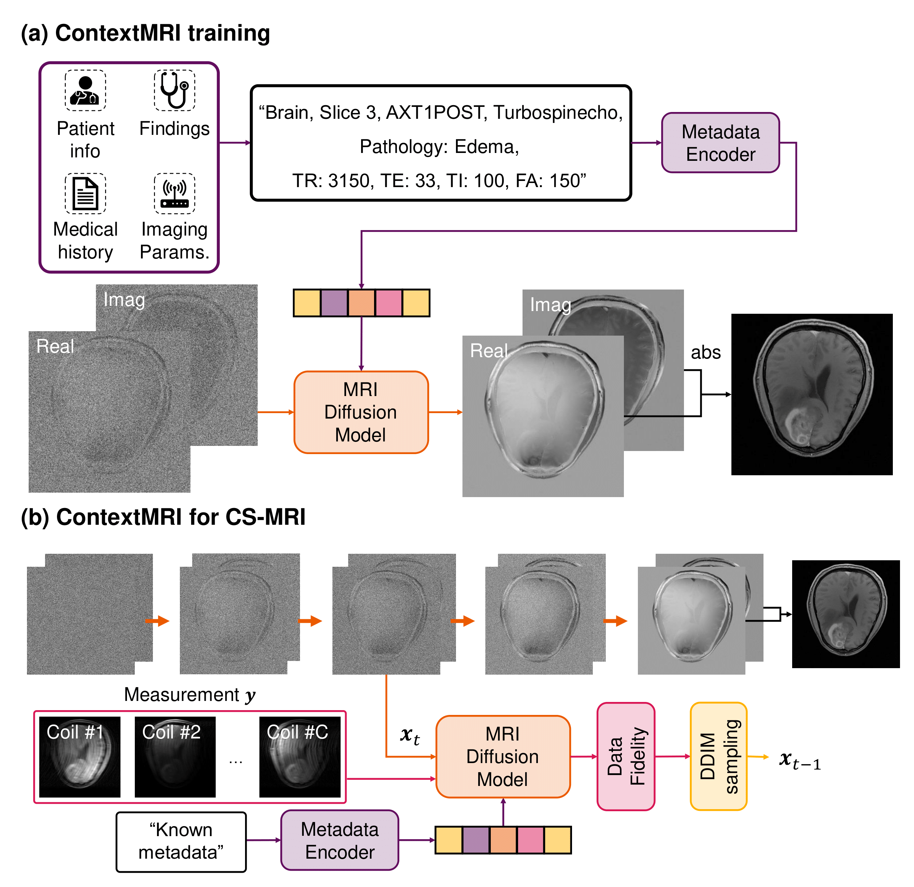

# ContextMRI
Official implementation of "[ContextMRI: Enhancing Compressed Sensing MRI through Metadata Conditioning](https://arxiv.org/abs/2501.04284)" by [Hyungjin Chung*](https://www.hj-chung.com/), [Dohun Lee*](https://scholar.google.co.kr/citations?user=vnzsr1UAAAAJ&hl=ko), [Zihui Wu](https://zihuiwu.github.io/), [Byung-Hoon Kim](https://egyptdj.notion.site/NAIPL-f6283de309a04223b1c04793f5a10ce1), [Katherine L. Bouman](http://users.cms.caltech.edu/~klbouman/), and [Jong Chul Ye](https://bispl.weebly.com/professor.html).


---
## 🔥 Summary 

Compressed sensing MRI seeks to accelerate MRI acquisition processes by sampling fewer k-space measurements and then reconstructing the missing data algorithmically. The success of these approaches often relies on strong priors or learned statistical models. While recent diffusion model-based priors have shown great potential, previous methods typically ignore clinically available metadata (e.g. patient demographics, imaging parameters, slice-specific information). In practice, metadata contains meaningful cues about the anatomy and acquisition protocol, suggesting it could further constrain the reconstruction problem. In this work, we propose ContextMRI, a text-conditioned diffusion model for MRI that integrates granular metadata into the reconstruction process. We train a pixel-space diffusion model directly on minimally processed, complex-valued MRI images. During inference, metadata is converted into a structured text prompt and fed to the model via CLIP text embeddings. By conditioning the prior on metadata, we unlock more accurate reconstructions and show consistent gains across multiple datasets, acceleration factors, and undersampling patterns. Our experiments demonstrate that increasing the fidelity of metadata—ranging from slice location and contrast to patient age, sex, and pathology—systematically boosts reconstruction performance. This work highlights the untapped potential of leveraging clinical context for inverse problems and opens a new direction for metadata-driven MRI reconstruction.

## 🗓 ️News
- [9 Jan 2025] Code are uploaded.

## 🛠️ Setup
First, create your environment. We recommend using the following comments. 

```
git clone https://github.com/DoHunLee1/ContextMRI.git
cd ContextMRI

conda create -n contextmri python=3.10
conda activate contextmri
conda install pytorch==2.1.0 torchvision==0.16.0 torchaudio==2.1.0 pytorch-cuda=12.1 -c pytorch -c nvidia
pip install -r requirements.txt
```

## ⏳ Models

|Models|Checkpoints|
|:---------|:--------|
|ContextMRI|[Hugging Face](https://huggingface.co/DHCAI/ContextMRI)

## 🌄 Example
An example of using **ContextMRI** is provided in the inference.sh, recon_mri.sh code. Also you can train using train.sh for Text-conditioned MRI foundation model.

## 📝 Citation
If you find our method useful, please cite as below or leave a star to this repository.

```
@article{chung2025contextmri,
  title={ContextMRI: Enhancing Compressed Sensing MRI through Metadata Conditioning},
  author={Chung, Hyungjin and Lee, Dohun and Wu, Zihui and Kim, Byung-Hoon and Bouman, Katherine L. and Ye, Jong Chul},
  journal={arXiv preprint arXiv:2501.04284},
  year={2025}
}
```

## 🤗 Acknowledgements
We thank the contributors of [DeepFloyd](https://github.com/deep-floyd/IF) for sharing their awesome work. 

> [!note]
> This work is currently in the preprint stage, and there may be some changes to the code.
